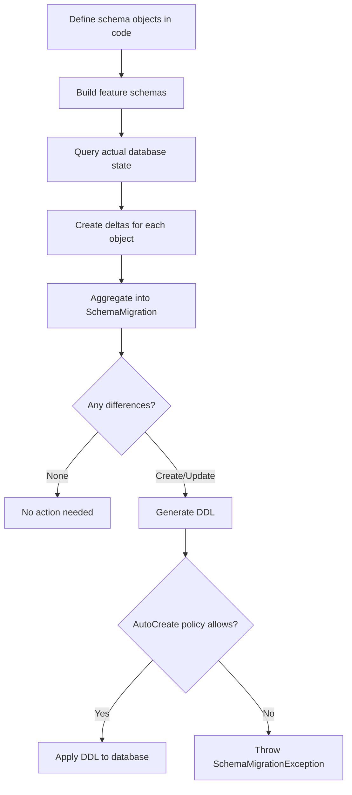

# Schema Migrations

Weasel's migration system detects differences between your configured schema objects and the actual state of a live database, then generates and optionally applies the DDL needed to bring the database in line. The process is fully automated and works across all supported providers.

## Migration Flow



## The IDatabase Interface

`IDatabase` (in `Weasel.Core.Migrations`) is the central interface for managing a database's schema lifecycle:

<!-- snippet: sample_IDatabase_interface -->
<a id='snippet-sample_IDatabase_interface'></a>
```cs
public interface IDatabase_Sample
{
    AutoCreate AutoCreate { get; }
    Migrator Migrator { get; }
    string Identifier { get; }
    List<string> TenantIds { get; }

    IFeatureSchema[] BuildFeatureSchemas();
    string[] AllSchemaNames();
    IEnumerable<ISchemaObject> AllObjects();

    Task<SchemaMigration> CreateMigrationAsync(CancellationToken ct = default);
    Task<SchemaMigration> CreateMigrationAsync(IFeatureSchema group, CancellationToken ct = default);

    Task<SchemaPatchDifference> ApplyAllConfiguredChangesToDatabaseAsync(
        AutoCreate? @override = null,
        ReconnectionOptions? reconnectionOptions = null,
        CancellationToken ct = default);

    Task AssertDatabaseMatchesConfigurationAsync(CancellationToken ct = default);
    string ToDatabaseScript();
}
```
<sup><a href='https://github.com/JasperFx/weasel/blob/master/src/DocSamples/SchemaMigrationSamples.cs#L8-L31' title='Snippet source file'>snippet source</a> | <a href='#snippet-sample_IDatabase_interface' title='Start of snippet'>anchor</a></sup>
<!-- endSnippet -->

Key methods:

| Method | Purpose |
|--------|---------|
| `BuildFeatureSchemas()` | Returns all feature schemas in dependency order. |
| `CreateMigrationAsync()` | Compares configured objects against the live database and returns a `SchemaMigration`. |
| `ApplyAllConfiguredChangesToDatabaseAsync()` | Detects changes and applies them, respecting the `AutoCreate` policy. |
| `AssertDatabaseMatchesConfigurationAsync()` | Throws if the database does not match configuration. Useful for production startup checks. |
| `ToDatabaseScript()` | Returns the full DDL creation script as a string. |

## IFeatureSchema

An `IFeatureSchema` groups related schema objects together (for example, all the tables and indexes for a document storage feature):

<!-- snippet: sample_IFeatureSchema_interface -->
<a id='snippet-sample_IFeatureSchema_interface'></a>
```cs
public interface IFeatureSchema_Sample
{
    ISchemaObject[] Objects { get; }
    string Identifier { get; }
    Migrator Migrator { get; }
    Type StorageType { get; }
}
```
<sup><a href='https://github.com/JasperFx/weasel/blob/master/src/DocSamples/SchemaMigrationSamples.cs#L33-L41' title='Snippet source file'>snippet source</a> | <a href='#snippet-sample_IFeatureSchema_interface' title='Start of snippet'>anchor</a></sup>
<!-- endSnippet -->

Weasel processes features in the order returned by `BuildFeatureSchemas()`, so dependency relationships between features should be reflected by their position in the array.

## SchemaMigration

The `SchemaMigration` class aggregates deltas from multiple schema objects into a single migration result:

<!-- snippet: sample_check_migration_result -->
<a id='snippet-sample_check_migration_result'></a>
```cs
var migration = await database.CreateMigrationAsync();

// Check the overall result
if (migration.Difference == SchemaPatchDifference.None)
{
    // Database is up to date
}
```
<sup><a href='https://github.com/JasperFx/weasel/blob/master/src/DocSamples/SchemaMigrationSamples.cs#L55-L63' title='Snippet source file'>snippet source</a> | <a href='#snippet-sample_check_migration_result' title='Start of snippet'>anchor</a></sup>
<!-- endSnippet -->

`SchemaMigration` exposes the collection of `ISchemaObjectDelta` instances and computes the aggregate `Difference` as the minimum (most severe) difference across all deltas.

## AutoCreate Policy

The `AutoCreate` enum (from the `JasperFx` namespace) controls what schema changes Weasel is allowed to make at runtime:

| Value | Behavior | Recommended Use |
|-------|----------|----------------|
| `All` | Creates, updates, and recreates objects as needed. May drop and rebuild tables that cannot be incrementally updated. | Development and testing. |
| `CreateOrUpdate` | Creates missing objects and applies incremental updates. Never drops existing objects. | Staging or early production deployments. |
| `CreateOnly` | Creates missing objects only. Will not modify existing objects. | Controlled deployments. |
| `None` | No runtime schema changes. Throws if the database does not match. | Production with CI/CD-managed migrations. |

Set the policy on your database instance:

<!-- snippet: sample_set_autocreate_policy -->
<a id='snippet-sample_set_autocreate_policy'></a>
```cs
// In development -- let Weasel manage everything
database.AutoCreate = AutoCreate.All;

// In production -- fail fast if the schema is wrong
database.AutoCreate = AutoCreate.None;
```
<sup><a href='https://github.com/JasperFx/weasel/blob/master/src/DocSamples/SchemaMigrationSamples.cs#L68-L74' title='Snippet source file'>snippet source</a> | <a href='#snippet-sample_set_autocreate_policy' title='Start of snippet'>anchor</a></sup>
<!-- endSnippet -->

You can also override the policy for a single call:

<!-- snippet: sample_override_autocreate_policy -->
<a id='snippet-sample_override_autocreate_policy'></a>
```cs
await database.ApplyAllConfiguredChangesToDatabaseAsync(
    @override: AutoCreate.CreateOrUpdate
);
```
<sup><a href='https://github.com/JasperFx/weasel/blob/master/src/DocSamples/SchemaMigrationSamples.cs#L79-L83' title='Snippet source file'>snippet source</a> | <a href='#snippet-sample_override_autocreate_policy' title='Start of snippet'>anchor</a></sup>
<!-- endSnippet -->

## The Migrator

Each database provider has a `Migrator` subclass that knows how to format SQL for that engine:

- `PostgresqlMigrator` -- wraps DDL in transactions, handles `CREATE SCHEMA IF NOT EXISTS`
- `SqlServerMigrator` -- uses `GO` batch separators, handles `dbo` schema conventions
- `OracleMigrator` -- Oracle-specific DDL formatting
- `SqliteMigrator` -- simplified DDL without schema creation SQL (SQLite schemas are fixed)

The `Migrator` is used internally by `WriteCreateStatement()`, `WriteDropStatement()`, and `WriteUpdate()` on every schema object and delta.

## Putting It Together

A typical migration workflow in application startup:

<!-- snippet: sample_typical_migration_workflow -->
<a id='snippet-sample_typical_migration_workflow'></a>
```cs
// 1. Configure your database with schema objects
var database = new MyPostgresqlDatabase(dataSource);

// 2. Apply all changes (respects AutoCreate policy)
var result = await database.ApplyAllConfiguredChangesToDatabaseAsync();

// result is SchemaPatchDifference.None if no changes were needed
```
<sup><a href='https://github.com/JasperFx/weasel/blob/master/src/DocSamples/SchemaMigrationSamples.cs#L88-L96' title='Snippet source file'>snippet source</a> | <a href='#snippet-sample_typical_migration_workflow' title='Start of snippet'>anchor</a></sup>
<!-- endSnippet -->

For CI/CD pipelines, you can generate migration scripts without applying them:

<!-- snippet: sample_generate_migration_script -->
<a id='snippet-sample_generate_migration_script'></a>
```cs
// Generate a migration script file
await database.WriteMigrationFileAsync("migrations/next.sql");

// Or get the full creation script
var script = database.ToDatabaseScript();
```
<sup><a href='https://github.com/JasperFx/weasel/blob/master/src/DocSamples/SchemaMigrationSamples.cs#L101-L107' title='Snippet source file'>snippet source</a> | <a href='#snippet-sample_generate_migration_script' title='Start of snippet'>anchor</a></sup>
<!-- endSnippet -->

## Migration Logging

Implement `IMigrationLogger` to capture the SQL that Weasel generates:

<!-- snippet: sample_IMigrationLogger_interface -->
<a id='snippet-sample_IMigrationLogger_interface'></a>
```cs
public interface IMigrationLogger_Sample
{
    void SchemaChange(string sql);
    void OnFailure(DbCommand command, Exception ex);
}
```
<sup><a href='https://github.com/JasperFx/weasel/blob/master/src/DocSamples/SchemaMigrationSamples.cs#L43-L49' title='Snippet source file'>snippet source</a> | <a href='#snippet-sample_IMigrationLogger_interface' title='Start of snippet'>anchor</a></sup>
<!-- endSnippet -->

The default logger writes SQL to `Console.WriteLine` and rethrows exceptions.
