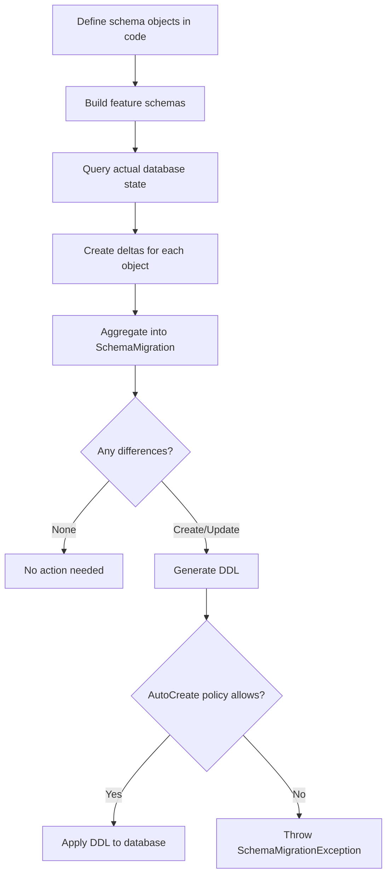

# Schema Migrations

Weasel's migration system detects differences between your configured schema objects and the actual state of a live database, then generates and optionally applies the DDL needed to bring the database in line. The process is fully automated and works across all supported providers.

## Migration Flow


```mermaid
flowchart TD
    A[Define schema objects in code] --> B[Build feature schemas]
    B --> C[Query actual database state]
    C --> D[Create deltas for each object]
    D --> E[Aggregate into SchemaMigration]
    E --> F{Any differences?}
    F -- None --> G[No action needed]
    F -- Create/Update --> H[Generate DDL]
    H --> I{AutoCreate policy allows?}
    I -- Yes --> J[Apply DDL to database]
    I -- No --> K[Throw SchemaMigrationException]
```

## The IDatabase Interface

`IDatabase` (in `Weasel.Core.Migrations`) is the central interface for managing a database's schema lifecycle:

<!-- snippet: sample_IDatabase_interface -->
<a id='snippet-sample_idatabase_interface'></a>
```cs
public interface IDatabase_Sample
{
    AutoCreate AutoCreate { get; }
    Migrator Migrator { get; }
    string Identifier { get; }
    List<string> TenantIds { get; }

    IFeatureSchema[] BuildFeatureSchemas();
    string[] AllSchemaNames();
    IEnumerable<ISchemaObject> AllObjects();

    Task<SchemaMigration> CreateMigrationAsync(CancellationToken ct = default);
    Task<SchemaMigration> CreateMigrationAsync(IFeatureSchema group, CancellationToken ct = default);

    Task<SchemaPatchDifference> ApplyAllConfiguredChangesToDatabaseAsync(
        AutoCreate? @override = null,
        ReconnectionOptions? reconnectionOptions = null,
        CancellationToken ct = default);

    Task AssertDatabaseMatchesConfigurationAsync(CancellationToken ct = default);
    string ToDatabaseScript();
}
```
<sup><a href='https://github.com/JasperFx/weasel/blob/master/src/DocSamples/SchemaMigrationSamples.cs#L8-L31' title='Snippet source file'>snippet source</a> | <a href='#snippet-sample_idatabase_interface' title='Start of snippet'>anchor</a></sup>
<!-- endSnippet -->

Key methods:

| Method | Purpose |
|--------|---------|
| `BuildFeatureSchemas()` | Returns all feature schemas in dependency order. |
| `CreateMigrationAsync()` | Compares configured objects against the live database and returns a `SchemaMigration`. |
| `ApplyAllConfiguredChangesToDatabaseAsync()` | Detects changes and applies them, respecting the `AutoCreate` policy. |
| `AssertDatabaseMatchesConfigurationAsync()` | Throws if the database does not match configuration. Useful for production startup checks. |
| `ToDatabaseScript()` | Returns the full DDL creation script as a string. |

## IFeatureSchema

An `IFeatureSchema` groups related schema objects together (for example, all the tables and indexes for a document storage feature):

<!-- snippet: sample_IFeatureSchema_interface -->
<a id='snippet-sample_ifeatureschema_interface'></a>
```cs
public interface IFeatureSchema_Sample
{
    ISchemaObject[] Objects { get; }
    string Identifier { get; }
    Migrator Migrator { get; }
    Type StorageType { get; }
}
```
<sup><a href='https://github.com/JasperFx/weasel/blob/master/src/DocSamples/SchemaMigrationSamples.cs#L33-L41' title='Snippet source file'>snippet source</a> | <a href='#snippet-sample_ifeatureschema_interface' title='Start of snippet'>anchor</a></sup>
<!-- endSnippet -->

Weasel processes features in the order returned by `BuildFeatureSchemas()`, so dependency relationships between features should be reflected by their position in the array.

## SchemaMigration

The `SchemaMigration` class aggregates deltas from multiple schema objects into a single migration result:

<!-- snippet: sample_check_migration_result -->
<a id='snippet-sample_check_migration_result'></a>
```cs
var migration = await database.CreateMigrationAsync();

// Check the overall result
if (migration.Difference == SchemaPatchDifference.None)
{
    // Database is up to date
}
```
<sup><a href='https://github.com/JasperFx/weasel/blob/master/src/DocSamples/SchemaMigrationSamples.cs#L55-L63' title='Snippet source file'>snippet source</a> | <a href='#snippet-sample_check_migration_result' title='Start of snippet'>anchor</a></sup>
<!-- endSnippet -->

`SchemaMigration` exposes the collection of `ISchemaObjectDelta` instances and computes the aggregate `Difference` as the minimum (most severe) difference across all deltas.

## AutoCreate Policy

The `AutoCreate` enum (from the `JasperFx` namespace) controls what schema changes Weasel is allowed to make at runtime:

| Value | Behavior | Recommended Use |
|-------|----------|----------------|
| `All` | Creates, updates, and recreates objects as needed. May drop and rebuild tables that cannot be incrementally updated. | Development and testing. |
| `CreateOrUpdate` | Creates missing objects and applies incremental updates to objects in the model, **including dropping columns, indexes and foreign keys that the model no longer declares**. Never drops or recreates a whole object, and never touches objects the model does not know about. | Staging or early production deployments. |
| `CreateOnly` | Creates missing objects only. Will not modify existing objects. | Controlled deployments. |
| `None` | Makes no schema changes at runtime: a session that touches a missing table gets the provider's own error. An *explicit* apply still migrates -- see below. Drift is only reported by `db-assert`. | Production with CI/CD-managed migrations. |

::: warning `CreateOrUpdate` is not "additive only"
`CreateOrUpdate` will not drop a table, but for a table it does know about, the `Update` delta
drops columns that are present in the database and absent from the model, along with extra
indexes and extra foreign keys. Removing a field from a mapped document under `CreateOrUpdate`
drops that column and the data in it. If you need a strictly additive policy, use `CreateOnly`.
:::

::: warning `AutoCreate.None` does not throw
Two paths read `None`, and neither one throws:

- The lazy per-feature path (`IDatabase.EnsureStorageExistsAsync`) returns immediately without
  touching the database, so a missing table surfaces later as the provider's own error --
  `42P01` on PostgreSQL, `SqlException 208` on SQL Server.
- The full apply path -- `ApplyAllConfiguredChangesToDatabaseAsync`, and therefore `db-apply` and
  `resources setup` -- **coerces `None` to `CreateOrUpdate` and migrates anyway**, because an
  explicit apply is intent to provision.

The only path that reports drift is `AssertDatabaseMatchesConfigurationAsync` / `db-assert`,
which throws a `DatabaseValidationException` regardless of the `AutoCreate` setting. So
`AutoCreate.None` plus `db-assert` in your deployment pipeline is the combination that actually
fails fast; `AutoCreate.None` on its own only means "do not migrate lazily".
:::

Set the policy on your database instance:

<!-- snippet: sample_set_autocreate_policy -->
<a id='snippet-sample_set_autocreate_policy'></a>
```cs
// In development -- let Weasel manage everything
database.AutoCreate = AutoCreate.All;

// In production -- never migrate lazily. Pair with db-assert to fail on drift
database.AutoCreate = AutoCreate.None;
```
<sup><a href='https://github.com/JasperFx/weasel/blob/master/src/DocSamples/SchemaMigrationSamples.cs#L68-L74' title='Snippet source file'>snippet source</a> | <a href='#snippet-sample_set_autocreate_policy' title='Start of snippet'>anchor</a></sup>
<!-- endSnippet -->

You can also override the policy for a single call:

<!-- snippet: sample_override_autocreate_policy -->
<a id='snippet-sample_override_autocreate_policy'></a>
```cs
await database.ApplyAllConfiguredChangesToDatabaseAsync(
    @override: AutoCreate.CreateOrUpdate
);
```
<sup><a href='https://github.com/JasperFx/weasel/blob/master/src/DocSamples/SchemaMigrationSamples.cs#L79-L83' title='Snippet source file'>snippet source</a> | <a href='#snippet-sample_override_autocreate_policy' title='Start of snippet'>anchor</a></sup>
<!-- endSnippet -->

## The Migrator

Each database provider has a `Migrator` subclass that knows how to format SQL for that engine:

- `PostgresqlMigrator` -- wraps DDL in transactions, handles `CREATE SCHEMA IF NOT EXISTS`
- `SqlServerMigrator` -- uses `GO` batch separators, handles `dbo` schema conventions
- `OracleMigrator` -- Oracle-specific DDL formatting
- `SqliteMigrator` -- simplified DDL without schema creation SQL (SQLite schemas are fixed)

### Privileges needed to apply a migration

A migration only needs the privilege to create what is actually missing. Both the PostgreSQL and SQL Server
migrators check whether a schema exists before attempting to create it, so applying a delta into a schema
that is already there does not require a database-level create privilege -- only the privileges the objects
in the delta need.

This matters because a schema-level grant is the usual way to let an application manage its own tables while
a separate migration role owns everything else. On PostgreSQL, `GRANT USAGE, CREATE ON SCHEMA my_schema TO
my_app` is enough for that application to apply its own migrations, and it needs no `CREATE` on the database.
Creating the schema in the first place does, so a role without it has to be given the schema up front.

The `Migrator` is used internally by `WriteCreateStatement()`, `WriteDropStatement()`, and `WriteUpdate()` on every schema object and delta.

## Putting It Together

A typical migration workflow in application startup:

<!-- snippet: sample_typical_migration_workflow -->
<a id='snippet-sample_typical_migration_workflow'></a>
```cs
// 1. Configure your database with schema objects
var database = new MyPostgresqlDatabase(dataSource);

// 2. Apply all changes (respects AutoCreate policy)
var result = await database.ApplyAllConfiguredChangesToDatabaseAsync();

// result is SchemaPatchDifference.None if no changes were needed
```
<sup><a href='https://github.com/JasperFx/weasel/blob/master/src/DocSamples/SchemaMigrationSamples.cs#L88-L96' title='Snippet source file'>snippet source</a> | <a href='#snippet-sample_typical_migration_workflow' title='Start of snippet'>anchor</a></sup>
<!-- endSnippet -->

For CI/CD pipelines, you can generate migration scripts without applying them:

<!-- snippet: sample_generate_migration_script -->
<a id='snippet-sample_generate_migration_script'></a>
```cs
// Generate a migration script file
await database.WriteMigrationFileAsync("migrations/next.sql");

// Or get the full creation script
var script = database.ToDatabaseScript();
```
<sup><a href='https://github.com/JasperFx/weasel/blob/master/src/DocSamples/SchemaMigrationSamples.cs#L101-L107' title='Snippet source file'>snippet source</a> | <a href='#snippet-sample_generate_migration_script' title='Start of snippet'>anchor</a></sup>
<!-- endSnippet -->

## Permissions

A migration is refused by the database far more often for want of privilege than for anything
wrong with the DDL. Weasel translates the providers' own permission errors into
`InsufficientDatabasePrivilegeException`, which names the role, the database, the statement that
was refused, and the two remedies. The provider exception -- `PostgresException` 42501,
`SqlException` 262/229/297, `MySqlException` 1142/1044, `OracleException` ORA-01031 -- is kept as
the `InnerException`, so nothing is hidden.

<!-- snippet: sample_catch_insufficient_privilege -->
<a id='snippet-sample_catch_insufficient_privilege'></a>
```cs
try
{
    await database.ApplyAllConfiguredChangesToDatabaseAsync();
}
catch (InsufficientDatabasePrivilegeException e)
{
    // e.Role, e.Database and e.Statement say who was refused and what for, and the
    // provider's own exception is still there as e.InnerException
    logger.LogError(e, "{Role} cannot migrate {Database}", e.Role, e.Database);
    throw;
}
```
<sup><a href='https://github.com/JasperFx/weasel/blob/master/src/DocSamples/SchemaMigrationSamples.cs#L80-L92' title='Snippet source file'>snippet source</a> | <a href='#snippet-sample_catch_insufficient_privilege' title='Start of snippet'>anchor</a></sup>
<!-- endSnippet -->

The two remedies, both of which are deployment decisions rather than code ones:

1. **Grant the role what it needs** -- `CREATE` on the schema, or ownership of the objects being
   altered. Note that on PostgreSQL, `CREATE SCHEMA` checks `CREATE` on the *database* before it
   evaluates its own `IF NOT EXISTS`, which is why Weasel guards schema creation with a
   `pg_namespace` lookup: a role holding `CREATE` on one schema and nothing on the database can
   still migrate into it.
2. **Pre-provision the schema.** Run the output of `db-patch` as a privileged user, and run the
   application itself with `AutoCreate.None` so it never attempts DDL. Pair that with `db-assert`
   in your deployment pipeline, since `AutoCreate.None` on its own does not report drift.

### Introspection is privilege-filtered

The other half of the same problem, and the one that does not announce itself. Catalog
introspection -- `information_schema`, `pg_*`, `sys.*`, `all_*` -- is filtered by the connection's
privileges on every provider, so an object the role cannot see reads back exactly like one that
does not exist. A restricted role therefore makes Weasel conclude that *every* object is missing:
under `CreateOrUpdate` it will then try to create them and hit the permission failure above, and
under `db-assert` it reports the entire configuration as absent.

`AssertDatabaseMatchesConfigurationAsync` says so when the failure has that shape -- every object
checked reported missing, and more than one of them -- so a validation failure against a database
that is demonstrably not empty points at grants rather than at drift.

## Migration Logging

Implement `IMigrationLogger` to capture the SQL that Weasel generates:

<!-- snippet: sample_IMigrationLogger_interface -->
<a id='snippet-sample_imigrationlogger_interface'></a>
```cs
public interface IMigrationLogger_Sample
{
    void SchemaChange(string sql);
    void OnFailure(DbCommand command, Exception ex);
}
```
<sup><a href='https://github.com/JasperFx/weasel/blob/master/src/DocSamples/SchemaMigrationSamples.cs#L43-L49' title='Snippet source file'>snippet source</a> | <a href='#snippet-sample_imigrationlogger_interface' title='Start of snippet'>anchor</a></sup>
<!-- endSnippet -->

The default logger writes SQL to the console and rethrows exceptions. It also accepts a `TextWriter`, which is the simplest way to capture one database's DDL without implementing the interface:

```cs
var buffer = new StringWriter();
database.MigrationLogger = new DefaultMigrationLogger(buffer);
```

Prefer this over a hand-rolled `IMigrationLogger` when all you want is redirection. Every provider checks `logger is DefaultMigrationLogger` to decide whether a failed migration statement is rethrown with its original stack trace or handed to `OnFailure`, so a custom type changes the stack trace you get on a failure, while the `TextWriter` overload does not.

Databases implementing `IDatabaseWithMigrationLogger` — which includes everything deriving from `DatabaseBase<T>` — expose `MigrationLogger` as a settable property, so tooling that applies many databases can give each one its own destination rather than having them all write to a shared console.

## Schema Fingerprinting

For deployments with many databases and/or many replicas, repeated no-op applies (one per database, per
process start, per rolling update) are measurably expensive: `ApplyAllConfiguredChangesToDatabaseAsync`
introspects the catalog for every configured schema object even when nothing changed. Opt-in schema
fingerprinting turns the no-op apply into a single `SELECT`:

```cs
migrator.UseSchemaFingerprinting = true;
```

With the flag enabled, a successful **full** apply stamps a SHA-256 fingerprint of the configured
schema's expected DDL into `{DefaultSchemaName}.weasel_schema_fingerprints`. The next full apply
recomputes the fingerprint in memory and, when that exact fingerprint is present, returns immediately —
no global lock, no catalog introspection. Any configuration change (a new table, column, index, or
managed partition) changes the fingerprint and re-enables the real apply, which then adds a new stamp.

Semantics to be aware of:

* A matching stamp is **trusted**. Schema drift applied outside Weasel (manual DDL, another tool) is not
  detected while the stamp matches — exactly like an application that skips migrations altogether. Use
  `AssertDatabaseMatchesConfigurationAsync` when you need verification; it is unaffected by the stamp.
  Deleting the stamp row (or table) forces the next apply to run in full.
* Only the **full** apply reads or writes the stamp. Feature-level applies
  (`EnsureStorageExistsAsync`) behave exactly as before.
* Concurrent appliers re-check the stamp after attaining the global migration lock, so replicas racing
  through a rolling update do the introspection work at most once per configuration.
* Rows are keyed by the **fingerprint itself**, not by any per-database identity, so several logical
  databases sharing one physical database each keep their own stamp instead of overwriting each other's.
  A configuration change therefore leaves the previous row in place rather than replacing it; the table
  is capped at the 25 most recent stamps. Eviction is harmless — a database whose stamp was pruned runs
  one full apply and stamps again.

::: warning
Before weasel#439 the stamp was a single row in `weasel_schema_fingerprint` (singular), which meant two
logical databases on the same physical database silently overwrote each other's fingerprint and neither
ever short-circuited — measurably slower than leaving the feature off. If you evaluated fingerprinting
on a multi-store deployment and saw no benefit, that was why. The obsolete table is dropped
automatically on the first stamp after upgrading.
:::
