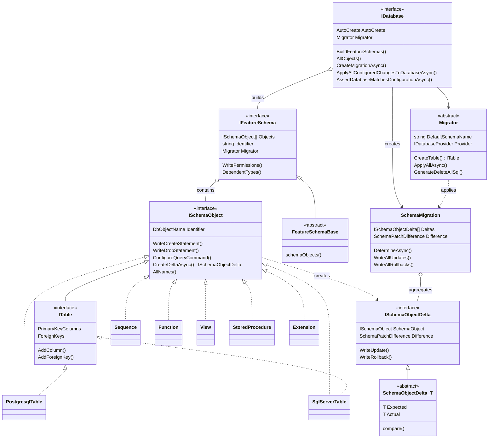

# Schema Objects

The `ISchemaObject` interface is the foundation of Weasel's schema management. Every database object -- whether a table, sequence, function, view, stored procedure, or extension -- implements this interface, giving Weasel a uniform way to create, drop, inspect, and diff any object in any supported database.

## Class Diagram



The diagram above shows the core type system. `ISchemaObject` implementations (tables, sequences, functions, etc.) produce `ISchemaObjectDelta` instances that describe the difference between expected and actual database state. These deltas are aggregated into a `SchemaMigration`, which the `Migrator` can apply. `IFeatureSchema` groups related schema objects, and `IDatabase` orchestrates the full migration lifecycle.

## The ISchemaObject Interface

Defined in `Weasel.Core`, the interface looks like this:

<!-- snippet: sample_ISchemaObject_interface -->
<a id='snippet-sample_ischemaobject_interface'></a>
```cs
public interface ISchemaObject_Sample
{
    DbObjectName Identifier { get; }

    void WriteCreateStatement(Migrator migrator, TextWriter writer);
    void WriteDropStatement(Migrator rules, TextWriter writer);
    void ConfigureQueryCommand(Weasel.Core.DbCommandBuilder builder);
    Task<ISchemaObjectDelta> CreateDeltaAsync(DbDataReader reader, CancellationToken ct = default);
    IEnumerable<DbObjectName> AllNames();
}
```
<sup><a href='https://github.com/JasperFx/weasel/blob/master/src/DocSamples/SchemaObjectSamples.cs#L6-L17' title='Snippet source file'>snippet source</a> | <a href='#snippet-sample_ischemaobject_interface' title='Start of snippet'>anchor</a></sup>
<!-- endSnippet -->

| Member | Purpose |
|--------|---------|
| `Identifier` | A `DbObjectName` that holds the schema and name of the object (e.g. `public.users` or `dbo.orders`). |
| `WriteCreateStatement()` | Writes the DDL to create this object in a target database. The `Migrator` parameter supplies provider-specific formatting rules. |
| `WriteDropStatement()` | Writes the DDL to drop this object. |
| `ConfigureQueryCommand()` | Registers the SQL query that fetches the current state of this object from the live database. |
| `CreateDeltaAsync()` | Reads the results of that query and returns an `ISchemaObjectDelta` describing how the expected configuration differs from the actual database state. |
| `AllNames()` | Returns every `DbObjectName` this object produces. A table typically returns its own name plus the names of any indexes it creates. |

## ISchemaObjectDelta

When Weasel compares what you *configured* against what *actually exists* in the database, the result is an `ISchemaObjectDelta`:

<!-- snippet: sample_ISchemaObjectDelta_interface -->
<a id='snippet-sample_ischemaobjectdelta_interface'></a>
```cs
public interface ISchemaObjectDelta_Sample
{
    ISchemaObject SchemaObject { get; }
    SchemaPatchDifference Difference { get; }
    void WriteUpdate(Migrator rules, TextWriter writer);
    void WriteRollback(Migrator rules, TextWriter writer);
    void WriteRestorationOfPreviousState(Migrator rules, TextWriter writer);
}
```
<sup><a href='https://github.com/JasperFx/weasel/blob/master/src/DocSamples/SchemaObjectSamples.cs#L19-L28' title='Snippet source file'>snippet source</a> | <a href='#snippet-sample_ischemaobjectdelta_interface' title='Start of snippet'>anchor</a></sup>
<!-- endSnippet -->

The `Difference` property tells you the outcome of the comparison using `SchemaPatchDifference`:

| Value | Meaning |
|-------|---------|
| `None` | The database matches configuration. No action needed. |
| `Create` | The object does not exist in the database and needs to be created. |
| `Update` | The object exists but differs from the configuration. An incremental update is possible. |
| `Invalid` | The object exists but cannot be updated incrementally. A full recreation may be required. |

## Provider Implementations

Each database provider supplies its own concrete implementations of `ISchemaObject`. For example, PostgreSQL tables live in `Weasel.Postgresql.Tables.Table`, while SQL Server tables are in `Weasel.SqlServer.Tables.Table`. Both implement `ITable` (which extends `ISchemaObject`), but each adds provider-specific features like PostgreSQL partitioning or SQL Server clustered indexes.

| Provider | Table | Sequence | Function | Stored Procedure | View | Other |
|----------|-------|----------|----------|-----------------|------|-------|
| PostgreSQL | `Table` | `Sequence` | `Function` | -- | `View` | `Extension` |
| SQL Server | `Table` | `Sequence` | `Function` | `StoredProcedure` | -- | `TableType` |
| Oracle | `Table` | `Sequence` | -- | -- | -- | -- |
| MySQL | `Table` | `Sequence` | -- | -- | -- | -- |
| SQLite | `Table` | -- | -- | -- | `View` | -- |

## SchemaObjectDelta&lt;T&gt;

Weasel provides a generic base class `SchemaObjectDelta<T>` that simplifies building deltas for a specific schema object type:

<!-- snippet: sample_SchemaObjectDelta_base_class -->
<a id='snippet-sample_schemaobjectdelta_base_class'></a>
```cs
public abstract class SchemaObjectDelta_Sample<T> : ISchemaObjectDelta where T : ISchemaObject
{
    public T Expected { get; } = default!;
    public T? Actual { get; }
    public SchemaPatchDifference Difference { get; }

    public ISchemaObject SchemaObject => Expected;

    protected abstract SchemaPatchDifference compare(T expected, T? actual);
    public abstract void WriteUpdate(Migrator rules, TextWriter writer);
    public abstract void WriteRollback(Migrator rules, TextWriter writer);
    public abstract void WriteRestorationOfPreviousState(Migrator rules, TextWriter writer);
}
```
<sup><a href='https://github.com/JasperFx/weasel/blob/master/src/DocSamples/SchemaObjectSamples.cs#L30-L44' title='Snippet source file'>snippet source</a> | <a href='#snippet-sample_schemaobjectdelta_base_class' title='Start of snippet'>anchor</a></sup>
<!-- endSnippet -->

The constructor calls `compare()` to determine the `Difference` between the expected and actual objects. If `Actual` is null, the object does not exist yet and the difference is `Create`.

## Post-Processing with ISchemaObjectWithPostProcessing

Some schema objects need to examine other objects before they can finalize their own configuration. For example, PostgreSQL partitioned tables may need to adjust foreign key definitions based on the partition strategy of related tables.

<!-- snippet: sample_ISchemaObjectWithPostProcessing_interface -->
<a id='snippet-sample_ischemaobjectwithpostprocessing_interface'></a>
```cs
public interface ISchemaObjectWithPostProcessing_Sample : ISchemaObject
{
    void PostProcess(ISchemaObject[] allObjects);
}
```
<sup><a href='https://github.com/JasperFx/weasel/blob/master/src/DocSamples/SchemaObjectSamples.cs#L46-L51' title='Snippet source file'>snippet source</a> | <a href='#snippet-sample_ischemaobjectwithpostprocessing_interface' title='Start of snippet'>anchor</a></sup>
<!-- endSnippet -->

The migration infrastructure calls `PostProcess()` after all objects have been loaded, passing the full array of schema objects so the implementing object can make any cross-object adjustments.

## DbObjectName

The `DbObjectName` record represents a qualified database object name with both a `Schema` and a `Name` component. Each provider has its own conventions:

| Provider | Default Schema | Example |
|----------|---------------|---------|
| PostgreSQL | `public` | `public.users` |
| SQL Server | `dbo` | `dbo.orders` |
| Oracle | `WEASEL` | `WEASEL.CUSTOMERS` |
| SQLite | `main` | `main.sessions` |
| MySQL | `public` | `public.products` |
